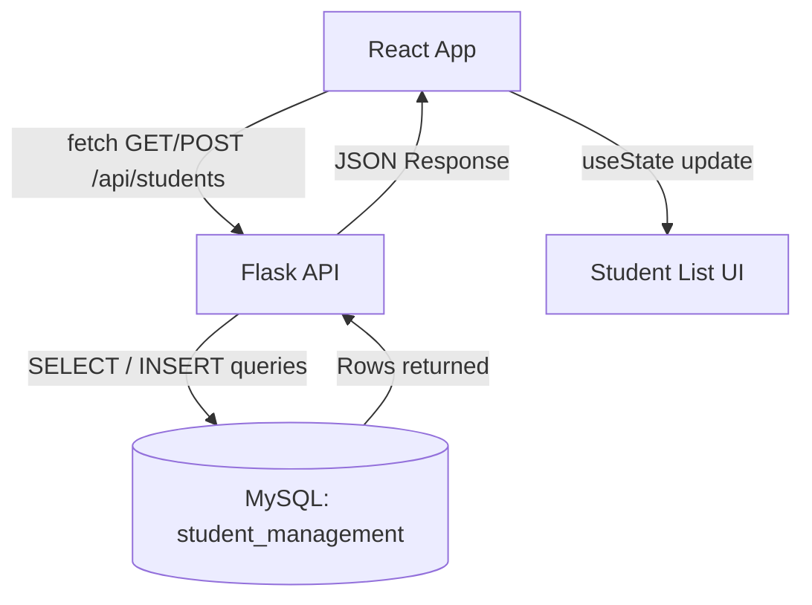

# Student Management — Full Stack Project (React + Flask + MySQL)

## Project Overview
A full-stack Student Management application built during the Innolift Ventures
internship (Crescent Batch 1). It started as a React form talking to a Flask
REST API (Day 41–42), added error handling and empty-state UI (Day 43), and
as of **Day 44** is backed by a real **MySQL** database instead of temporary
in-memory data — so student records now persist across server restarts and
page refreshes.

## Technology Stack
- **Frontend:** React 18 (Vite), plain CSS
- **Backend:** Flask 3, Flask-CORS
- **Database:** MySQL 8, accessed via `mysql-connector-python`
- **Config:** `python-dotenv` for environment variables

## MySQL Database Setup

1. Make sure MySQL Server is installed and running.
2. Run the provided schema script, which creates the database, the table,
   and 5 sample records:
   ```
   mysql -u root -p < database/schema.sql
   ```
3. (Recommended) Create a dedicated app user instead of using root:
   ```sql
   CREATE USER 'app_user'@'localhost' IDENTIFIED BY 'your_password_here';
   GRANT ALL PRIVILEGES ON student_management.* TO 'app_user'@'localhost';
   FLUSH PRIVILEGES;
   ```
4. Verify the data directly in MySQL:
   ```sql
   USE student_management;
   SELECT * FROM students;
   ```

## Database Structure

**Database:** `student_management`

**Table:** `students`

| Column | Type          | Notes                     |
|--------|---------------|----------------------------|
| id     | INT           | Primary key, auto-increment |
| name   | VARCHAR(100)  | Required                  |
| email  | VARCHAR(150)  | Required, unique          |
| course | VARCHAR(100)  | Required                  |

## API Endpoints

### `GET /api/students`
Retrieves all students from MySQL and returns them as JSON.

- **Success (200):** JSON array of student objects
  ```json
  [
    { "id": 1, "name": "Arun Kumar", "email": "arun.kumar@example.com", "course": "AI & Data Science" }
  ]
  ```
- **Failure (500):**
  ```json
  { "success": false, "message": "Unable to load students. Database connection failed." }
  ```

### `POST /api/students`
Validates the submitted data and inserts a new student into MySQL.

- **Request body:**
  ```json
  { "name": "New Student", "email": "new.student@example.com", "course": "Computer Science" }
  ```
- **Success (201):**
  ```json
  {
    "success": true,
    "message": "Student added successfully",
    "student": { "id": 6, "name": "New Student", "email": "new.student@example.com", "course": "Computer Science" }
  }
  ```
- **Validation failure (400):** missing field or invalid email format
- **Duplicate email (409):** `{ "success": false, "message": "A student with this email already exists." }`
- **Database failure (500):** `{ "success": false, "message": "Unable to save student. Database operation failed." }`

## Frontend → Backend → MySQL Architecture



**GET flow:** React loads → `fetch()` calls `GET /api/students` → Flask opens a
MySQL connection → runs `SELECT` → Flask returns JSON → React stores it with
`useState` → the student list renders.

**POST flow:** User fills the form → `fetch()` calls `POST /api/students` →
Flask validates the fields → Flask runs an `INSERT` against MySQL → MySQL
returns the new row's id → Flask responds with the created student → React
shows a success message and appends the student to the list, no refresh
needed.

## How to Run the Project

**1. Database**
```
mysql -u root -p < database/schema.sql
```

**2. Backend**
```
cd backend
cp .env.example .env      # then fill in your real DB credentials
pip install -r requirements.txt
python app.py
```
Runs on http://localhost:5000

**3. Frontend**
```
cd frontend
npm install
npm run dev
```
Runs on http://localhost:5173

## Environment Configuration

The backend reads its MySQL credentials from environment variables (via a
`.env` file), never from hardcoded values in `app.py`:

| Variable      | Description                  |
|---------------|-------------------------------|
| `DB_HOST`     | MySQL host, e.g. `localhost`  |
| `DB_USER`     | MySQL username                |
| `DB_PASSWORD` | MySQL password                |
| `DB_NAME`     | `student_management`          |

Copy `backend/.env.example` to `backend/.env` and fill in your real values.
**`.env` is listed in `.gitignore` and must never be committed to GitHub.**

## Error Handling

The backend catches and reports errors instead of crashing:

- **DB connection failure** → `500` with `"Database connection failed."`
- **Invalid/failed query** → `500` with `"Database operation failed."`
- **Missing required fields** → `400` with a field-specific message
- **Invalid email format** → `400`
- **Duplicate email** → `409` with `"A student with this email already exists."`

On the frontend, every fetch call is wrapped in `try...catch`, checks
`response.ok`/`result.success`, and turns any failure into a plain-language
message shown in the UI (e.g. *"Unable to load students."*), with the
loading/submitting state always reset in a `finally` block.

## API Testing (Day 45)

The backend API was tested independently of the React frontend using
**Postman**, to confirm it behaves correctly before the frontend ever
relies on it.

- Postman collection: `postman/Student_Management_API.postman_collection.json`
  (import directly into Postman — includes valid requests, invalid inputs,
  duplicate-email handling, and invalid route/method checks)
- Full test report with request/response pairs and a status-code reference
  table: `docs/day-45-api-testing.md`

**Result:** 10/10 tests passed — valid GET/POST, five invalid-input
variations, duplicate email, an invalid endpoint, and an unsupported HTTP
method all returned the correct status code and a consistent JSON error
shape, with no crashes. `404`/`405`/`500` error handlers were added to
`app.py` during this testing so *every* response, including routing errors,
returns JSON instead of Flask's default HTML error page.

## Project Progression

| Day | Milestone |
|---|---|
| Day 41 | React frontend ↔ Flask backend, basic connection |
| Day 42 | GET + POST endpoints, form handling, in-memory data |
| Day 43 | Error handling, loading state, empty-state UI |
| Day 44 | Flask ↔ MySQL integration, persistent storage |
| Day 45 | API testing with Postman, JSON error handlers for invalid routes/methods |

## Testing Checklist (performed for Day 44)

- ✅ GET returns the 5 seeded MySQL records
- ✅ POST with valid data inserts a row and appears instantly in the UI
- ✅ POST with a duplicate email returns 409 and a clear message
- ✅ POST with missing fields / invalid email returns 400 and a clear message
- ✅ Stopping MySQL / pointing to a bad host returns a graceful 500, not a crash
- ✅ New student added via the form is confirmed directly in MySQL
- ✅ Refreshing the React app reloads the same data from MySQL (persistence confirmed)
